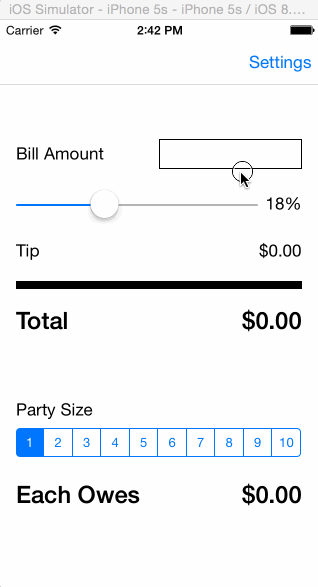

# A Simple iOS Tip Calculator

This is a tip calculator I built in Swift as part of the application process for an iOS bootcamp by [CodePath](http://codepath.com).  This is my first iOS app - I had zero knowledge of Objective-C/Swift prior to starting this.

Time spent: ~7 hours

Completed user stories:

 * [x] Required: User can calculate tip amount by entering bill amount and selecting desired tip percentage
 * [x] Required: User can set the default tip percentage on the Settings page (initially defaulted to 18%)
 * [x] Optional: Modified tip percentage control to be a slider (instead of segmented control) to allow for more options
 * [x] Optional: User can calculate how much each person in a party owes using the Party Size segmented control 
 * [x] Optional: User can set the default party size on the Settings page (initially defaulted to 1)
 * [x] Optional: User can set the option to round the party owes amount up (which is convenient when people only have cash bills and no change =])
 
Walkthrough of all user stories:

